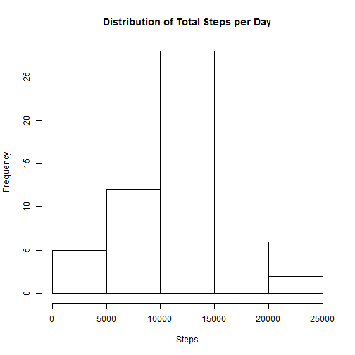
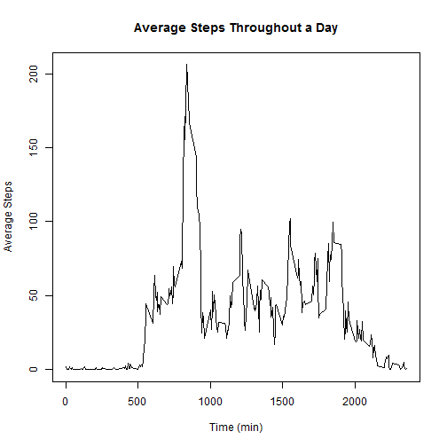
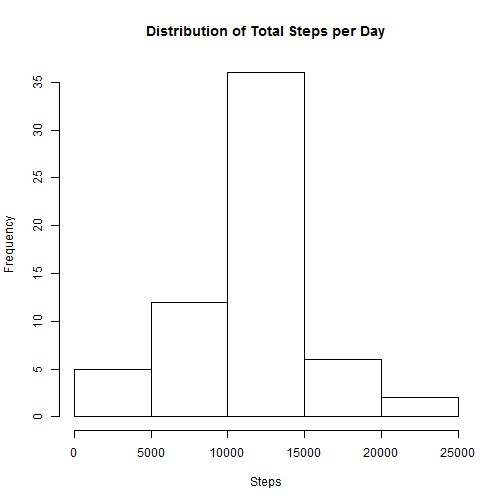
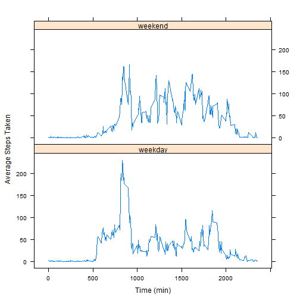

## Introduction
Data from smart gadgets is increasingly able to provide useful information to users, especially regarding fitness (such as distance traveled, calories burned, steps taken). But interpreting this data and converting it into a meaningful format requires data processing. The following report describes a sequence of code steps intended to convert data from an activity monitoring device, in the form of steps taken in each 5-minute interval over a number of days, into a graphical and statistical report.

## Code and Output
### Loading and pre-processing data
The following code will download the data if not already present, unzip the file, load the data into R, and do whatever pre-processing is necessary to analyze the data (in this case, converting the dates into Date format). A sample of the resulting data frame is shown below.

```r
if (!file.exists("activity.zip")) {
  download.file("https://d396qusza40orc.cloudfront.net/repdata%2Fdata%2Factivity.zip", 
                destfile = "activity.zip")
}

if (!file.exists("activity.csv")) {
  unzip("activity.zip")
}

fulldata <- read.csv("activity.csv")
fulldata$date <- as.Date(fulldata$date, "%Y-%m-%d")
head(fulldata)
```

```
##   steps       date interval
## 1    NA 2012-10-01        0
## 2    NA 2012-10-01        5
## 3    NA 2012-10-01       10
## 4    NA 2012-10-01       15
## 5    NA 2012-10-01       20
## 6    NA 2012-10-01       25
```

### Calculating steps taken per day
The following code calculates the average number of steps taken per day, first removing the NA values so they do not interfere with the calculation. Below is the result of this calculation.

```r
nona <- fulldata[complete.cases(fulldata),]
daysteps <- aggregate(nona$steps, list(Date = nona$date), sum)
daysteps
```

```
##          Date     x
## 1  2012-10-02   126
## 2  2012-10-03 11352
## 3  2012-10-04 12116
## 4  2012-10-05 13294
## 5  2012-10-06 15420
## 6  2012-10-07 11015
## 7  2012-10-09 12811
## 8  2012-10-10  9900
## 9  2012-10-11 10304
## 10 2012-10-12 17382
## 11 2012-10-13 12426
## 12 2012-10-14 15098
## 13 2012-10-15 10139
## 14 2012-10-16 15084
## 15 2012-10-17 13452
## 16 2012-10-18 10056
## 17 2012-10-19 11829
## 18 2012-10-20 10395
## 19 2012-10-21  8821
## 20 2012-10-22 13460
## 21 2012-10-23  8918
## 22 2012-10-24  8355
## 23 2012-10-25  2492
## 24 2012-10-26  6778
## 25 2012-10-27 10119
## 26 2012-10-28 11458
## 27 2012-10-29  5018
## 28 2012-10-30  9819
## 29 2012-10-31 15414
## 30 2012-11-02 10600
## 31 2012-11-03 10571
## 32 2012-11-05 10439
## 33 2012-11-06  8334
## 34 2012-11-07 12883
## 35 2012-11-08  3219
## 36 2012-11-11 12608
## 37 2012-11-12 10765
## 38 2012-11-13  7336
## 39 2012-11-15    41
## 40 2012-11-16  5441
## 41 2012-11-17 14339
## 42 2012-11-18 15110
## 43 2012-11-19  8841
## 44 2012-11-20  4472
## 45 2012-11-21 12787
## 46 2012-11-22 20427
## 47 2012-11-23 21194
## 48 2012-11-24 14478
## 49 2012-11-25 11834
## 50 2012-11-26 11162
## 51 2012-11-27 13646
## 52 2012-11-28 10183
## 53 2012-11-29  7047
```

The following code produces a histogram showing the distribution of steps per day, i.e. how frequently a value of total daily steps occurs within the data time frame. The graph is displayed below.

```r
hist(daysteps$x,xlab="Steps",main = "Distribution of Total Steps per Day")
```

 

The distribution appears to be normal, centered around 10000-15000 steps. The following code calculates the actual mean and median values of steps taken per day.


```r
daymean <- mean(daysteps$x)
daymedian <- median(daysteps$x)
paste("The mean number of steps per day is", round(daymean,3))
```

```
## [1] "The mean number of steps per day is 10766.189"
```

```r
paste("The median number of steps per day is", daymedian)
```

```
## [1] "The median number of steps per day is 10765"
```

### Calculating steps taken over the course of an average day
The following code averages the number of steps taken in each interval over all days in the dataset, and plots these values as average steps taken in each interval over the course of an average day. Then it determines which interval in an average day contains the greatest average number of steps. The plot and maximum interval are shown below.


```r
intsteps <- aggregate(nona$steps, list(Interval=nona$interval),mean)

## Plot time series of steps per interval vs. interval
plot(intsteps$Interval, intsteps$x, type = "l",xlab="Time (min)",ylab="Average Steps",
     main="Average Steps Throughout a Day")
```

 

```r
maxint <- which.max(intsteps$x)
paste("The 5-minute interval containing the highest average number of steps is number", maxint)
```

```
## [1] "The 5-minute interval containing the highest average number of steps is number 104"
```

### Dealing with missing values
The number of missing values in the dataset can be calculated using the following code:

```r
yesnas <- which(!complete.cases(fulldata))
length(yesnas)
```

```
## [1] 2304
```
Missing values occur only in the Steps column, not the Date or Interval columns.

The following code creates a new dataset, filling in missing values in their appropriate rows with the value for the same interval averaged over the whole dataset.

```r
fullerdata <- fulldata
for (i in 1:length(yesnas)) {
    place <- fulldata$interval[yesnas[i]]
    fullerdata$steps[yesnas[i]] <- intsteps$x[which(intsteps$Interval == place)]
}
```

As before, but now using the new, more complete dataset, the following code creates a histogram showing distribution of steps per day. It also calculates new mean and median values for steps per day.

```r
daysteps2 <- aggregate(fullerdata$steps, list(Date = fullerdata$date), sum)
hist(daysteps2$x,xlab="Steps",main = "Distribution of Total Steps per Day")
```

 

```r
daymean2 <- mean(daysteps2$x)
daymedian2 <- median(daysteps2$x)
paste("The mean number of steps per day is", round(daymean2,3))
```

```
## [1] "The mean number of steps per day is 10766.189"
```

```r
paste("The median number of steps per day is", round(daymedian2,3))
```

```
## [1] "The median number of steps per day is 10766.189"
```
This new dataset produces a more narrow histogram with the central range being higher and the others not changing much. The new mean is identical to the old, but the new median is slightly higher than the old (and identical to the mean).

### Comparing steps taken on weekdays vs. weekends
The following code adds a new variable to the more complete dataset, specifying whether each value was taken from a weekday or a weekend.

```r
for (i in 1:length(fullerdata[,1])) {
    if (weekdays(fullerdata$date[i]) == "Monday" | weekdays(fullerdata$date[i]) == "Tuesday" | weekdays(fullerdata$date[i]) == "Wednesday" | weekdays(fullerdata$date[i]) == "Thursday" | weekdays(fullerdata$date[i]) == "Friday") {
        fullerdata$weekday[i] <- "weekday"
    } else {
        fullerdata$weekday[i] <- "weekend"
    }
}
```

And finally, this last code calculates the average steps taken in each 5-minute interval over the course of an average weekday or an average weekend day, then combines these datasets and plots a time-course similar to the one above, except that there are separate plots for weekdays and weekend. This plot is shown below.


```r
## Average each interval across all weekdays
weekdaydata <- subset(fullerdata, fullerdata$weekday == "weekday")
wkdayintsteps <- aggregate(weekdaydata$steps, list(Interval=weekdaydata$interval),mean)
wkdayintsteps$weekday <- "weekday"

## Average each interval across all weekends
weekenddata <- subset(fullerdata, fullerdata$weekday == "weekend")
wkendintsteps <- aggregate(weekenddata$steps, list(Interval=weekenddata$interval),mean)
wkendintsteps$weekday <- "weekend"

## Combine datasets
byday <- wkdayintsteps
byday[289:576,] <- wkendintsteps

## Create dual plot of avg weekdays vs. weekends
library(lattice)
xyplot(x ~ Interval | weekday, data = byday, layout = c(1,2), type = "l", ylab="Average Steps Taken", xlab = "Time (min)")
```

 

## Conclusion
It appears that an average day contains about 11000 steps taken, and these are spread out more evenly on weekends, while on weekdays more are focused in a range of time near midday.

The code presented in this report was used to produce the results shown, and should prove useful for analyzing similar datasets.
